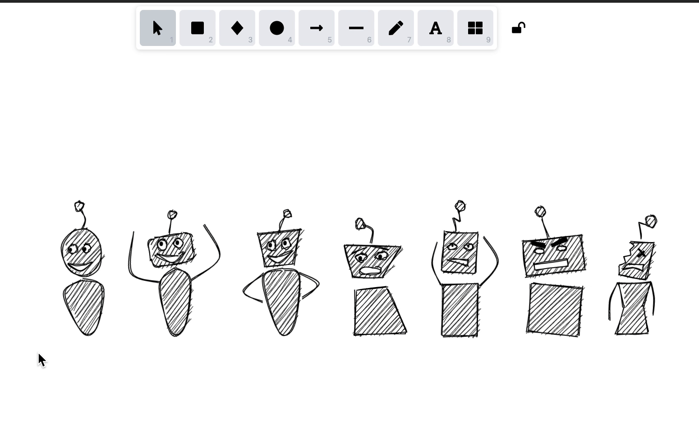

# Excalidraw Libraries

> Explore [libraries.excalidraw.com](https://libraries.excalidraw.com)

## Create your own library

1. Open [Excalidraw](https://excalidraw.com/) and draw some objects.
2. Optional: Make sure every object is it's own group (by selecting it
   and clicking "Group selection" or `Ctrl`+`G`).
3. Add each object you want in your library like so:
  - Select the object
  - Open the library menu (by clicking on the "library" button or
    typing `9`)
  - The selected object should appear in a square. Click on it (you
    will see a `+` sign when hovering over it)
4. Still in the library menu, click on "Export". You will get a
   `.excalidrawlib` file with all your added objects in it.

If you want to test your library file, use the "Load" button in the
library menu to reimport it.

## Add your own library to the list

1. Fork this repo
2. Create a directory with your `name` in the [`libraries`](libraries) (use `kebab-case` for all files and directories)
   1. Upload your `.excalidrawlib` files
   2. Upload the screenshot of the preview (as landscape PNG with max width 800px)
3. Edit the [`libraries.json`](libraries.json) and add your entry to the end
4. Create a Pull Request to this repo

Once reviewed and approved your library will appear on the [website](https://libraries.excalidraw.com), but keep in mind your libraries have to be for wide usage and not specific to your needs.

### Notes

By uploading libraries to our repo, you are automatically complying with our [MIT License](LICENSE), which in short means anyone can use them without restrictions.
